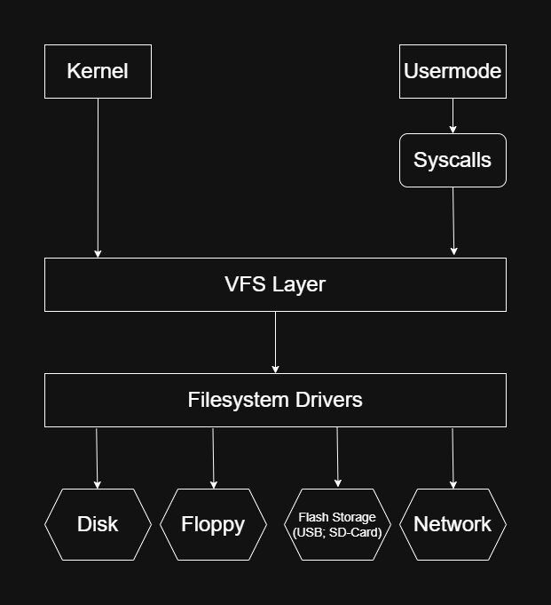

# VFS design

## Basic Design

The VFS has a design based on the [Sun Microsystems vnode paper by S.R. Kleiman](https://www.cs.fsu.edu/~awang/courses/cop5611_s2024/vnode.pdf). Which means
that it will use vnodes for accessing anything on the virtual filesystem. Below is a figure of the basic file system implementation:

 </br>
**Figure 1:** The basic VFS layout

From now on the term VFS will have the meaning of an abstraction of a filesystem on any supported storage medium.

---

The structures will be the same as the ones in the vnode paper so no need to put them here. Except the `statfs` structure which is below:

```c
struct statfs {
    uint32_t f_type;       // Filesystem type identifier
    uint32_t f_bsize;      // Optimal block size for transfers
    uint64_t f_blocks;     // Total number of blocks in the filesystem
    uint64_t f_bfree;      // Free blocks available to superuser
    uint64_t f_bavail;     // Free blocks available to non-root users
    uint64_t f_files;      // Total inodes (vnodes)
    uint64_t f_ffree;      // Free inodes (vnodes)
    uint64_t f_fsid;       // Filesystem ID
    uint32_t f_namelen;    // Maximum length of filenames
    uint32_t f_flags;      // Mount flags
    uint32_t f_spare[4];   // Padding for future expansion
};
```

**Figure 2:** Statfs structure </br>

## Disk Device Naming

The disk devices will be simple. They are a combination of the disk type and disk number. For partitions we also use the partition table entry number where the first partition on any disk is partition 0. The basic structure for names like I mentioned before would something be like this: `{disk_type}{disk_number (of that type)}` for example `nvme0` and for partitions we add a `p` after the disk number and then the partition "ID" (yes ik its not the id but who cares :P.) As an example: `nvme0p0` -> nvme disk 0 partion 0 (If its the NVMe booted from its the EFI System Partition). This also means unlimited disks!!!

## Paths

The paths in this VFS are UNIX based. The directory structure is different though (by which I mean the default directories). As an example path there would be `/bin/glob/cat`. I will explain the meaning of this later. Special paths are `~` which is the home of the current logged in user, when logged in as the root user the home directory will be the rootvfs' root directory (`/`). Paths are also case sensitive like Linux. So in the same directory you can have the file `HELLO.txt` and the file `hello.txt` </br>

---

As promised the Directory "structure"

```txt
/ (rootvfs' root)
├── bin (binary folder)
│   ├── glob (system wide executables)
│   │    └── ...
│   └── usr (user specific executables)
│       ├── user1
│       ├── user2
│       └── ...
├── boot (the boot partition is mounted here)
├── mnt (default folder mounted disks will be mounted to)
├── conf (config for the kernel and applications)
├── usr (user homes)
│   ├── user1
│   ├── user2
│   └── ...
├── proc (process information. This folder isnt stored on disk and is a "ramfs" so to say)
├── tmp (temporary files)
└── etc (other files. Its the etcettera folder)
```

I will not go to explain this. I think most of this is self explainatory.
